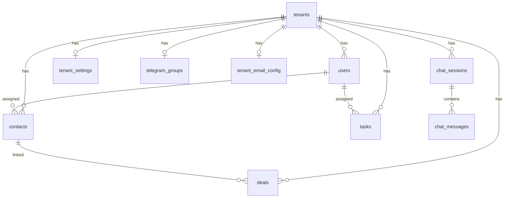

# NexCRM Entity Relationship Overview

All tenant-scoped tables include `tenant_id` FK → `tenants.id`.

Platform-level tables (`platform_admins`, `tenant_usage_logs`) are not tenant-filtered; they are super-admin only (Stage 7).
